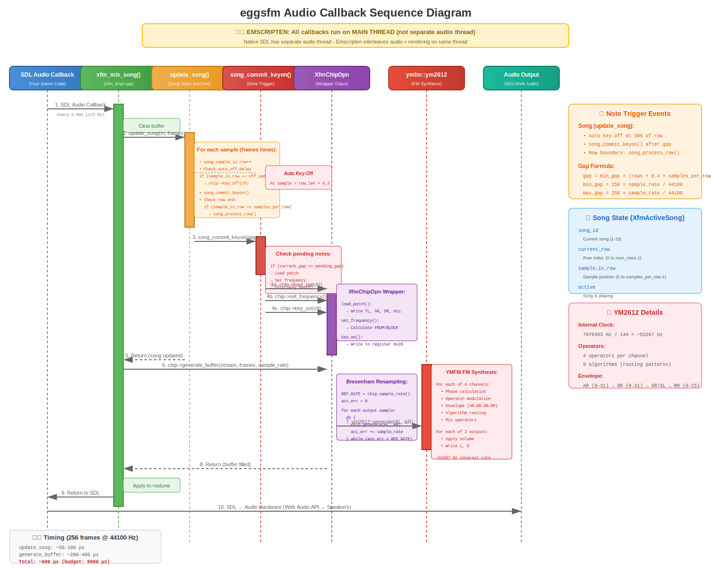
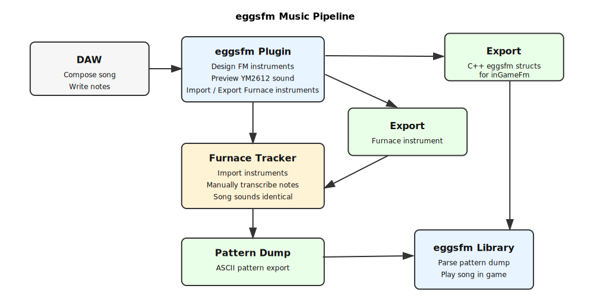

# eggsfm — Real-Time FM Synthesis for Games

**eggsfm** is a lightweight C++ library that brings authentic FM synthesis to your game. Emulating classic Yamaha YM chips (YM2612/YM3438), it generates music and sound effects in real-time — no audio files needed.

```
No samples. No loading. Just pure synthesis.
```

## Why eggsfm?

Traditional game audio loads `.wav` or `.ogg` files. eggsfm synthesizes everything from FM parameters at runtime, the same way a Sega Genesis produced sound in 1990.

**Benefits:**
- **Zero audio assets** — SFX and music are pure data in your code
- **Tiny footprint** — A complete SFX library is a few KB of text
- **Dynamic audio** — Change pitch, timbre, and volume at runtime
- **Unlimited voices** — Voice pooling handles concurrent sounds automatically
- **Authentic sound** — Real YM2612/YM3438 emulation via [ymfm](https://github.com/aaronsgiles/ymfm)
- **WAV fallback** — Pre-render to WAV for low-CPU platforms (optional)

## Quick Start

See **`example/simple_demo.cpp`** for a complete working example with:
- Drum machine (kick, snare, hi-hat)
- Piano keyboard (Z-M keys)
- SDL2 window for input handling

**Build and run:**
```bash
cd example
./build.sh
./simple_demo
```

## Architecture

eggsfm uses a **module-based** architecture. Each `xfm_module` is an independent FM chip instance with its own voice pool and patch library.

Typical setup:
- **Music module** — Dedicated to background music
- **SFX module** — Handles sound effects with voice pooling

```cpp
// Create separate modules for music and SFX
xfm_module* music = xfm_module_create(44100, 256, XFM_CHIP_YM2612);
xfm_module* sfx   = xfm_module_create(44100, 256, XFM_CHIP_YM2612);

// In your audio callback, mix both:
void audio_callback(void* userdata, Uint8* stream, int len) {
    int16_t* buf = (int16_t*)stream;
    int frames = len / 4;

    // Mix music (song only - optimized)
    xfm_mix_song(music, buf, frames);

    // Mix SFX (additive mixing)
    int16_t sfx_buf[2048];
    xfm_mix_sfx(sfx, sfx_buf, frames);

    // Add SFX to output
    for (int i = 0; i < frames * 2; i++) {
        buf[i] = (int16_t)((int32_t)buf[i] + sfx_buf[i]);
    }
}
```

## Audio Generation Pipeline



**Call Flow** (from SDL audio callback):

```
SDL Audio Callback (~172 Hz)
    ↓
xfm_mix() or xfm_mix_song() / xfm_mix_sfx()
    ↓
update_song() ──→ Triggers key_on()/key_off() at row boundaries
update_sfx()  ──→ Triggers key_on()/key_off() with dynamic gap
    ↓
chip->generate_buffer() ──→ YMFM FM synthesis
    ↓
Audio Output (int16_t stereo)
```

**Timing:**
- **Sample Rate:** 44100 Hz (configurable)
- **Buffer Size:** 256 frames (5.8 ms latency)
- **Callback Rate:** ~172 times per second
- **CPU Budget:** ~600 μs per callback

**Note Triggering:**
- **Song:** Notes trigger at row boundaries after gap samples
- **SFX:** Notes trigger with dynamic gap (scales with interval distance)
- **Gap Formula:** `gap_samples = sample_rate / (tick_rate × speed)`

## Sound Effects with Voice Pooling

The SFX system manages a **pool of 6 voices** (one per YM2612 channel). When you trigger an SFX:

1. eggsfm finds an available voice
2. If all voices are busy, it steals the lowest-priority voice
3. The SFX plays to completion, then the voice is freed

```cpp
// Define an SFX pattern (Furnace tracker format)
static const char* JUMP_SFX =
"6\n"          // 6 rows
"C-4007F\n"    // Row 0: C4, instrument 00, volume 7F
"E-4007F\n"    // Row 1: E4
"G-4007F\n"    // Row 2: G4
"C-5007F\n"    // Row 3: C5
"OFF....\n"    // Row 4: Note off
".......\n";   // Row 5: Rest

// Declare the SFX (ID 0, 60 ticks/sec, 3 ticks/row = 50ms/row)
xfm_sfx_declare(sfx_module, 0, JUMP_SFX, 60, 3);

// Play the SFX with priority 5 (higher = harder to steal)
xfm_sfx_play(sfx_module, 0, 5);
```

**Priority system:**
- Priority 1-2: Ambient sounds (footsteps, wind)
- Priority 3-4: Common gameplay (jump, coin, attack)
- Priority 5-6: Important events (damage, powerup)
- Priority 7-9: Critical (death, level complete)

When a new SFX needs a voice:
- Free voices are used first
- If all busy, lowest priority voice is stolen
- Equal priority → oldest voice is stolen

## Direct Note Triggering

For dynamic sounds (piano, procedural audio), trigger notes directly:

```cpp
// Load a patch first
xfm_patch_set(module, 0, &MY_PATCH, sizeof(MY_PATCH), XFM_CHIP_YM2612);

// Trigger a note (MIDI note 60 = C4, patch ID 0, velocity ignored)
xfm_voice_id voice = xfm_note_on(module, 60, 0, 0);

// Later, release the note
xfm_note_off(module, voice);
```

Notes use the voice pool automatically — if all 6 voices are busy, the oldest is stolen.

## Song Mode (Furnace Tracker Patterns)

For background music, eggsfm supports **multi-channel songs** in Furnace tracker format. Unlike SFX (which use the voice pool), songs explicitly control all 6 channels:

```cpp
// 2-channel song example (5 channels total in Furnace format)
static const char* SONG =
"64\n"  // 64 rows
"C-3007F....|C#30266....|C-3017F....|E-3017F....|G-3017F....\n"
"...........|...........|...........|...........|...........\n"
// ... more rows
;

// Declare song (ID 1, 60 ticks/sec, 6 ticks/row = 100ms/row)
xfm_song_declare(music_module, 1, SONG, 60, 6);

// Assign patches to instruments
xfm_patch_set(music_module, 0x00, &BASS_PATCH, sizeof(BASS_PATCH), XFM_CHIP_YM2612);
xfm_patch_set(music_module, 0x01, &CHORD_PATCH, sizeof(CHORD_PATCH), XFM_CHIP_YM2612);
xfm_patch_set(music_module, 0x02, &HIHAT_PATCH, sizeof(HIHAT_PATCH), XFM_CHIP_YM2612);

// Play song (looping)
xfm_song_play(music_module, 1, 1);  // 1 = loop
```

**Song format:**
- Each row has 5 channel columns separated by `|`
- Column format: `note(3) + instrument(2) + volume(2) + effects(4)`
- Note: `C-4` = C in octave 4, `OFF` = note off, `...` = hold
- Instrument: `00`-`FF` (hex, refers to loaded patches)
- Volume: `00`-`7F` (hex, 7F = max)

**Switching songs:**
```cpp
// Switch immediately
xfm_song_play(music_module, 2, 1);

// Or schedule at next row boundary
xfm_song_schedule(music_module, 2, FM_SONG_SWITCH_STEP);
```

## WAV Playback Mode (Low-CPU Alternative)

For platforms that can't afford real-time synthesis, eggsfm provides a **WAV playback API** (`xfm_wavplay.h`) that mirrors the synthesis API:

```cpp
#include "xfm_wavplay.h"

// Create WAV playback modules
xfm_wav_module* music = xfm_wav_module_create(44100, 256);
xfm_wav_module* sfx = xfm_wav_module_create(44100, 256);

// Load pre-rendered WAV files
xfm_wav_load_file(music, XFM_WAV_SONG, 1, "song_1.wav");
xfm_wav_load_file(sfx, XFM_WAV_SFX, 0, "jump.wav");

// Set volumes (same API as synthesis)
xfm_wav_module_set_volume(music, 0.8f);
xfm_wav_module_set_volume(sfx, 0.5f);

// Play
xfm_wav_song_play(music, 1, true);
xfm_wav_sfx_play(sfx, 0, 5);

// Mix in audio callback
xfm_wav_mix_song(music, buffer, frames);
xfm_wav_mix_sfx(sfx, sfx_buffer, frames);
```

**Export tools:**
```cpp
// Export synthesized songs/SFX to WAV
xfm_export_song(module, 1, "song_1.wav");
xfm_export_sfx(module, 0, "jump.wav");
```

## Music Production Pipeline



**Workflow:**
1. **DAW** → Compose song structure
2. **YM2612 Plugin** → Design FM instruments (Furnace format)
3. **Furnace Tracker** → Import instruments, transcribe notes
4. **Pattern Export** → ASCII format for eggsfm
5. **inGameFm Library** → Parse and play in game

## Patch Format

eggsfm uses YM2612 register-level patches. Each patch has 4 operators with these parameters:

```cpp
typedef struct {
    int8_t  DT;   // Detune:        -3 to +3
    uint8_t MUL;  // Multiplier:    0-15
    uint8_t TL;   // Total Level:   0-127 (0 = loudest!)
    uint8_t RS;   // Rate Scaling:  0-3
    uint8_t AR;   // Attack Rate:   0-31 (31 = instant)
    uint8_t AM;   // AM Enable:     0-1
    uint8_t DR;   // Decay Rate:    0-31
    uint8_t SR;   // Sustain Rate:  0-31
    uint8_t SL;   // Sustain Level: 0-15
    uint8_t RR;   // Release Rate:  0-15
    uint8_t SSG;  // SSG-EG:        0-8
} xfm_patch_opn_operator;

typedef struct {
    uint8_t ALG;  // Algorithm:     0-7
    uint8_t FB;   // Feedback:      0-7
    uint8_t AMS;  // AM Sensitivity: 0-3
    uint8_t FMS;  // FM Sensitivity: 0-7
    xfm_patch_opn_operator op[4];
} xfm_patch_opn;
```

**Key points:**
- **TL (Total Level)** is attenuation — 0 is loudest, 127 is silent
- **AR=31** gives instant attack (no fade-in)
- **ALG** determines which operators are carriers vs modulators

## API Reference

### Module Lifecycle
```cpp
// Synthesis modules
xfm_module* xfm_module_create(int sample_rate, int buffer_frames, XfmChipType chip);
void xfm_module_destroy(xfm_module* m);

// WAV playback modules
xfm_wav_module* xfm_wav_module_create(int sample_rate, int buffer_frames);
void xfm_wav_module_destroy(xfm_wav_module* m);
```

### Patches
```cpp
void xfm_patch_set(xfm_module* m, int patch_id, const xfm_patch_opn* patch,
                   int size, XfmChipType type);
```

### Sound Effects
```cpp
// Synthesis
void xfm_sfx_declare(xfm_module* m, int sfx_id, const char* pattern,
                     int tick_rate, int speed);
xfm_voice_id xfm_sfx_play(xfm_module* m, int sfx_id, int priority);

// WAV playback
int xfm_wav_load_file(xfm_wav_module* m, xfm_wav_type type, int id, const char* filename);
xfm_wav_voice_id xfm_wav_sfx_play(xfm_wav_module* m, int sfx_id, int priority);
```

### Songs
```cpp
// Synthesis
void xfm_song_declare(xfm_module* m, int song_id, const char* pattern,
                      int tick_rate, int speed);
void xfm_song_play(xfm_module* m, int song_id, int loop);
void xfm_song_schedule(xfm_module* m, int song_id, XfmSongSwitch timing);

// WAV playback
int xfm_wav_load_file(xfm_wav_module* m, xfm_wav_type type, int id, const char* filename);
void xfm_wav_song_play(xfm_wav_module* m, int song_id, int loop);
```

### Direct Notes
```cpp
xfm_voice_id xfm_note_on(xfm_module* m, int midi_note, int patch_id, int velocity);
void xfm_note_off(xfm_module* m, xfm_voice_id voice);
```

### Audio Output
```cpp
// Synthesis
void xfm_mix(xfm_module* m, int16_t* stream, int frames);
void xfm_mix_song(xfm_module* m, int16_t* stream, int frames);  // Song only
void xfm_mix_sfx(xfm_module* m, int16_t* stream, int frames);   // SFX only

// WAV playback
void xfm_wav_mix(xfm_wav_module* m, int16_t* stream, int frames);
void xfm_wav_mix_song(xfm_wav_module* m, int16_t* stream, int frames);
void xfm_wav_mix_sfx(xfm_wav_module* m, int16_t* stream, int frames);
```

### Volume & LFO
```cpp
// Synthesis
void xfm_module_set_volume(xfm_module* m, float volume);  // 0.0 - 1.0
void xfm_module_set_lfo(xfm_module* m, bool enable, int freq);

// WAV playback
void xfm_wav_module_set_volume(xfm_wav_module* m, float volume);
```

### Export Functions
```cpp
int xfm_export_song(xfm_module* m, xfm_song_id song_id, const char* filename);
int xfm_export_sfx(xfm_module* m, int sfx_id, const char* filename);
```

## Dependencies

| Dependency | Purpose | Get |
|---|---|---|
| **ymfm** | YM2612/YM3438 emulation | https://github.com/aaronsgiles/ymfm |
| **SDL2** | Audio output (optional) | https://libsdl.org |

ymfm is header-only — compile the `.cpp` files alongside your code.

## Build Example

```bash
YMFM=/path/to/ymfm/src
SDL_INC=/path/to/SDL2/include

g++ -std=c++17 -O2 \
    -I$YMFM -I$SDL_INC \
    $YMFM/ymfm_misc.cpp $YMFM/ymfm_adpcm.cpp \
    $YMFM/ymfm_ssg.cpp  $YMFM/ymfm_opn.cpp \
    xfm_impl.cpp your_game.cpp \
    -lSDL2 -o your_game
```

## Web Demo

The `demo/` directory contains a full-featured WebAssembly demo with:
- Aurora shader background
- ImGui-based UI
- Patch editors for all instruments
- Song switching
- SFX buttons
- Piano keyboard

**Build for web:**
```bash
cd demo
./build.sh
```

Then open `localhost:8000` in your browser.

## License

eggsfm is released under the MIT License. See LICENSE for details.

The ymfm library (Aaron Giles) is BSD-licensed — see https://github.com/aaronsgiles/ymfm

---

**Made with 🥚 for the demoscene and indie game community**
